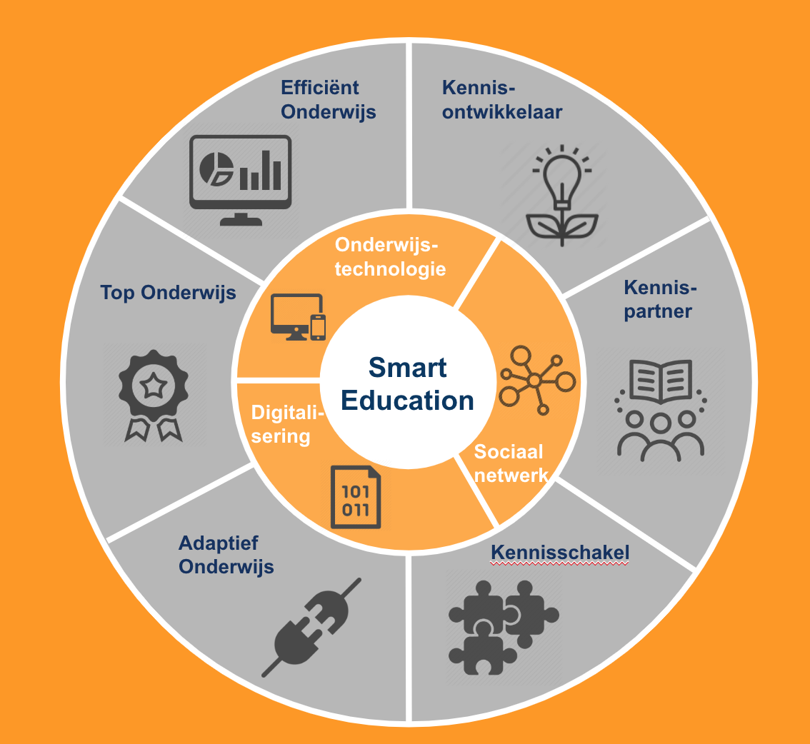

# Open Science Programma

## Informatie

### Why?
Rol HAN als kennisontwikkelaar / partner / deler

## Acties

## NB
- Is de HAN manier de beste manier om dit project te doen?
- Is de HAN de standaard op het gebied van HBO-ICT (zijn wij een voorbeeld voor anderen)?
- Voorbeeld Mike die binnen een week een CRM-systeem bouwt voor Praktijkbureau BK?
- Zit je hier voor het project / product of om je belangen te verdedigen?

## Netwerk
